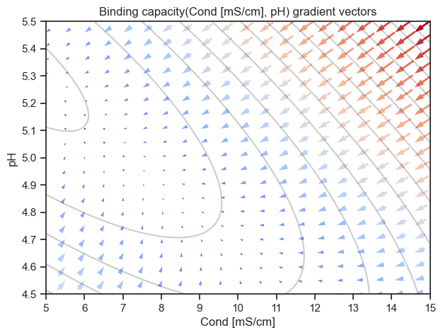
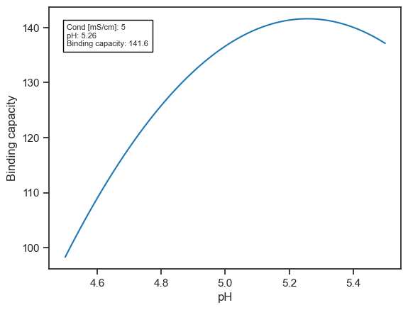

# Modeling tool

<div style="text-align:center">
    
</div>

This python package has been developed to analyze experimental data obtained within the framework of 'Designs of Experiments'. Application is capable of model validation, visualization of the outcome and finding the critical values. Please check how to use in [real case scenario](./examples/Optimization.ipynb).

## Dependencies
The application has a few [dependencies](./requirements.txt), which can be installed with python pip module.

```shell
python -m pip install -r doe-models/requirements.txt
```

## Downloading and installation
Download the repository and install the package with python 'pip' module.

```shell
git clone https://github.com/kameelsky/doe-models.git
python -m pip install doe-models/source
```

## License
[MIT License](./LICENSE.md)

## Example

```python
# Import the libraries
from models.two_factors import POL
from pandas import read_csv

# Create an instance of LIQ class
model = POL(x_1 = "Cond [mS/cm]",
            x_2 = "pH",
            y_i = "Binding capacity",
            Data = read_csv('./data/example_data.csv', index_col="No"))
```
```python
# Returns a response surface contour plot
model.rsp(figure_size = (7,5), step_x = 1, step_y = 0.1, dpi = 100,
          contours_number = 15, contour_color = "black", contour_font_size = 10,  color_map = "RdYlGn")
```


```python
# Returns a gradient plot
model.gradient(figure_size = (7,5), step_x = 1, step_y = 0.1, dpi = 100, contours_alpha=0.2)
```



Magnitude of gradient vector $\left|\vec{R}\right|$ equals 0 at $x_1$ and $x_2$ coordinates for which function $f\left(x_1,x_2\right)$ returns the critical points. Therefore, to find $x_1$ and $x_2$ values which return gradient vector $\left[0\hat{i},0\hat{j}\right]$, partial derivatives were solved for respective scalars of $\hat{i}$ and $\hat{j}$ vectors:

$\vec{R} = \nabla f(x_{1}, x_{2}) = \left[\frac{\partial f(x_1, x_2)}{\partial x_1} \hat i, \frac{\partial f(x_1, x_2)}{\partial x_2} \hat j \\ \right] = \left[0 \hat i , 0 \hat j \\ \right]$

$\frac{\partial f}{\partial x_1} (x_1, x_2) \hat i = \beta_1 + 2\beta_{11}x_1 + \beta_{12}x_2 = 0 \hat i$

$\frac{\partial f}{\partial x_2} (x_1, x_2) \hat j  = \beta_2 + 2\beta_{22}x_2 + \beta_{12}x_1 = 0 \hat j$

After combining formulas $\frac{\partial f}{\partial x_1} (x_1, x_2) \hat i$ and $\frac{\partial f}{\partial x_2} (x_1, x_2) \hat j$, $x_1$ and $x_2$ coordinates for which function returns critical points were conveniently calculated using linear algebra. The coefficient matrix took form of the Hessian matrix and its eigenvalues were used to classify the critical point.

```python
# We solve the model
model.solve()
```

    Cond [mS/cm]: 3.30
    pH: 5.41
    Critical value: 142.51
    Hessian matrix eigenvalues: [-0.63, -152.44]

Since loading the protein in the buffer with such low conductivity is not sensible, we focus on particular value of the 'Cond [ms/cm]'.

```python
model.constant_plot(value=("Cond [mS/cm]", 5), loc=(0.05, 0.85))
```


More usefull plots and functions can be found in the [examples](./examples/) directory.