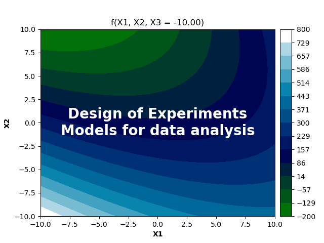
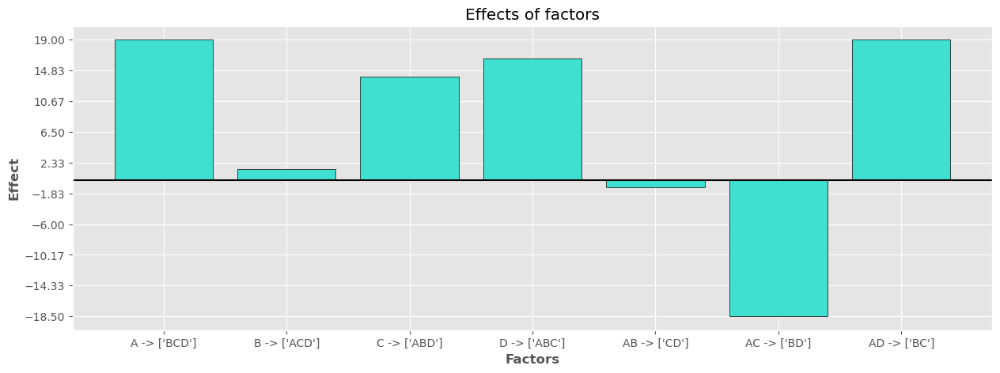
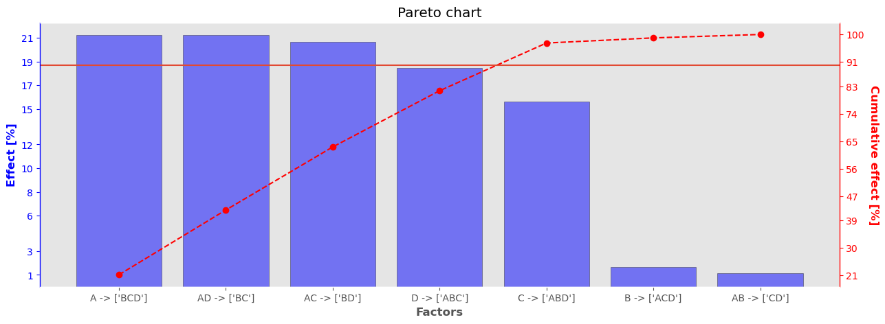
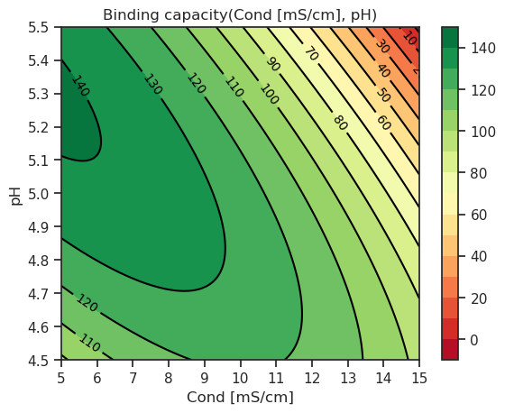

# Design of Experiments and empirical models

<div style="text-align:center">
    
</div>

This python package has been developed to analyze experimental data obtained within the framework of 'Designs of Experiments'. 

Package can help with an analysis of screening experiemnts conducted with utilization of a commonly used design **factorial 2<sup>k</sup>**.
It is also capable of model validation, visualization of the outcome and finding the critical values in two factors optimization. Please check how to use it in [real case scenarios](./examples/).

## Dependencies and installation
The application has a few which can be installed with python [pip module](./requirements.txt):

```shell
python -V # Checks for python version. Python 3.11 
git clone https://github.com/kameelsky/doe-models.git # Downloads the repository
python -m pip install -r doe-models/requirements.txt # Installs dependencies
python -m pip install doe-models/source # Installs doe-models
```

or using [conda](./requirements.yml):

```shell
git clone https://github.com/kameelsky/doe-models.git # Downloads the repository
conda env create --file doe-models/requirements.yml # Creates a virtual environment
conda activate doe-models # Activates the virtual environment
python -m pip install doe-models/source # Installs doe-models
```

## License
[MIT License](./LICENSE.md)

## Examples

### Screen
```python
# Import the libraries
from doemodels.factorial import Factorial2k

# Create an instance of Factorial2k class for four factors
design = Factorial2k(["A", "B", "C", "D"])

# Create a fractional factorial
design.fractional("ABCD")

# Get a dictionary of aliased factors
design.aliases
```
{'A': ['BCD'],
 'B': ['ACD'],
 'C': ['ABD'],
 'D': ['ABC'],
 'AB': ['CD'],
 'AC': ['BD'],
 'AD': ['BC'],
 'BC': ['AD'],
 'BD': ['AC'],
 'CD': ['AB'],
 'ABC': ['D'],
 'ABD': ['C'],
 'ACD': ['B'],
 'BCD': ['A']}

```python
# Provide the responses
design.effect(response=[45, 65, 60, 80, 100, 45, 75, 96], n=1, graph=True)
```


```python
# Plot a Pareto chart
design.pareto()
```



More detailed analysis can be found in the [jupyter notebook](./examples/Screen.ipynb).

### Optimization
```python
# Import the libraries
from doemodels.two_factors import POL
from pandas import read_csv

# Create an instance of LIQ class
model = POL(x_1 = "Cond [mS/cm]",
            x_2 = "pH",
            y_i = "Binding capacity",
            Data = read_csv('./data/example_data.csv', index_col="No"))
```
```python
# Returns a response surface contour plot
model.rsp(figure_size = (7,5), step_x = 1, step_y = 0.1, dpi = 100,
          contours_number = 15, contour_color = "black", contour_font_size = 10,  color_map = "RdYlGn")
```



```python
# We solve the model
model.solve()
```

    Cond [mS/cm]: 3.30
    pH: 5.41
    Critical value: 142.51
    Hessian matrix eigenvalues: [-0.63, -152.44]