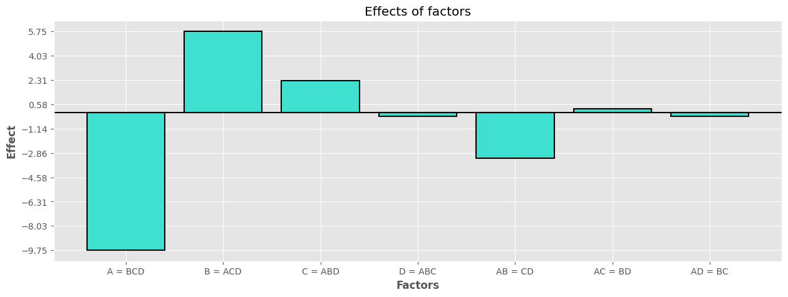
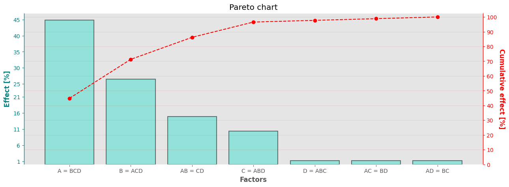

# Design of Experiments and empirical models

<div style="text-align:center">
    
</div>

This python package has been developed to analyze experimental data obtained within the framework of 'Designs of Experiments'. 

Package can help with an analysis of screening experiemnts conducted with utilization of a commonly used design **factorial 2<sup>k</sup>**.

## Dependencies and installation
The application has a few which can be installed with python [pip module](./requirements.txt):

```shell
python -V # Checks for python version. Python 3.12
git clone https://github.com/kameelsky/doe-models.git # Downloads the repository
python -m pip install -r doe-models/requirements.txt # Installs dependencies
python -m pip install doe-models/source # Installs doe-models
```

## License
[MIT License](./LICENSE.md)

## Examples

```python
# Import the libraries
from doemodels.factorial import Factorial2k

# Create an instance of Factorial2k class for four factors
design = Factorial2k(["A", "B", "C", "D"])

# Create a fractional factorial
design.fractional("ABCD")

# Get a dictionary of aliased factors
design.aliases
```
{'A': ['BCD'],
 'B': ['ACD'],
 'C': ['ABD'],
 'D': ['ABC'],
 'AB': ['CD'],
 'AC': ['BD'],
 'AD': ['BC'],
 'BC': ['AD'],
 'BD': ['AC'],
 'CD': ['AB'],
 'ABC': ['D'],
 'ABD': ['C'],
 'ACD': ['B'],
 'BCD': ['A']}

```python
# Provide the responses
design.effect(response=[45, 65, 60, 80, 100, 45, 75, 96], n=1, graph=True)
```


```python
# Plot a Pareto chart
design.pareto(graph=True)
```



More detailed analysis can be found in the [jupyter notebook](https://github.com/kameelsky/data-science/blob/master/Toolbox/DOE.ipynb).